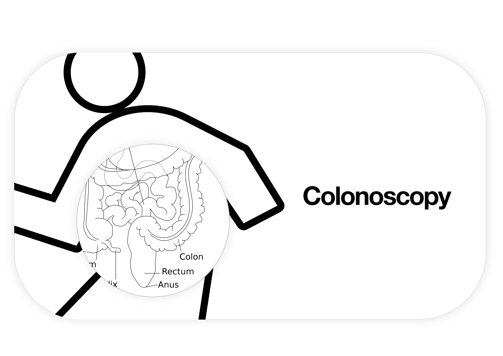

<!--
👋 Hello! As Nova users browse the extensions library, a good README can help them understand what your extension does, how it works, and what setup or configuration it may require.

Not every extension will need every item described below. Use your best judgement when deciding which parts to keep to provide the best experience for your new users.

💡 Quick Tip! As you edit this README template, you can preview your changes by selecting **Extensions → Activate Project as Extension**, opening the Extension Library, and selecting "Colonoscopia" in the sidebar.

Let's get started!
-->

<!--
🎈 Include a brief description of the features your extension provides. For example:
-->

**Colonoscopia** helps to add semicolons at the end of lines.

Nova adds matching brackets, automatically and by default. This means that, by the time at which the user nearly finishes their statement and the semicolon only is missing, the cursor isn't at the end of the line —where the semicolon needs to be.

For that reason, a Nova user may find themselves typing *⌘⇨;⮐* a lot. To save some *⌘⇨;⮐*-like key combinations, including *⌘⇨;⮐*, this extension…

- …defines a *⇧⮐* shortcut, which inserts a semicolon at the end of the line and moves your cursor to its end;
- defines an *⌥⮐* shortcut, which inserts a semicolon at the end of the line and continues at a new line;
- and defines an *⌥⌘⮐* shortcut, which adds a semicolon at the end of the line but keeps the cursor position.

It's a clone of [*Colonizer*](https://marketplace.visualstudio.com/items?itemName=vmsynkov.colonize), except the name *Colonoscopia* may be a little bit less upsetting to some. It also works with Nova, of course.

## Requirements

Colonoscopia does not require any additional software.

## Usage

To make use of the functionality provided by Colonoscopia, try any of the shortcuts that are mentioned above. I find that *⌥⮐* is the most useful to me.

<!--
👋 That's it! Happy developing!

P.S. If you'd like, you can remove these comments before submitting your extension 😉
-->

## Etymology

> **Michael:** *\[on phone\]* Hello David. I just got back from my procedure, so-  
> **David:** Michael, what the hell is going on here?  
> **Michael:** How are you doing?  
> **David:** Fine. What is going on?  
> **Michael:** *\[reading from computer\]* My colonoscopy was an examination of my large colon and the distal part of my small bowel with a camera.  
> **David:** Why did you OK this golden ticket idea? We're going to lose a fortune, Michael. How could you let this happen?  

_— Michael Scott, on the importance of semicolons in programming._
